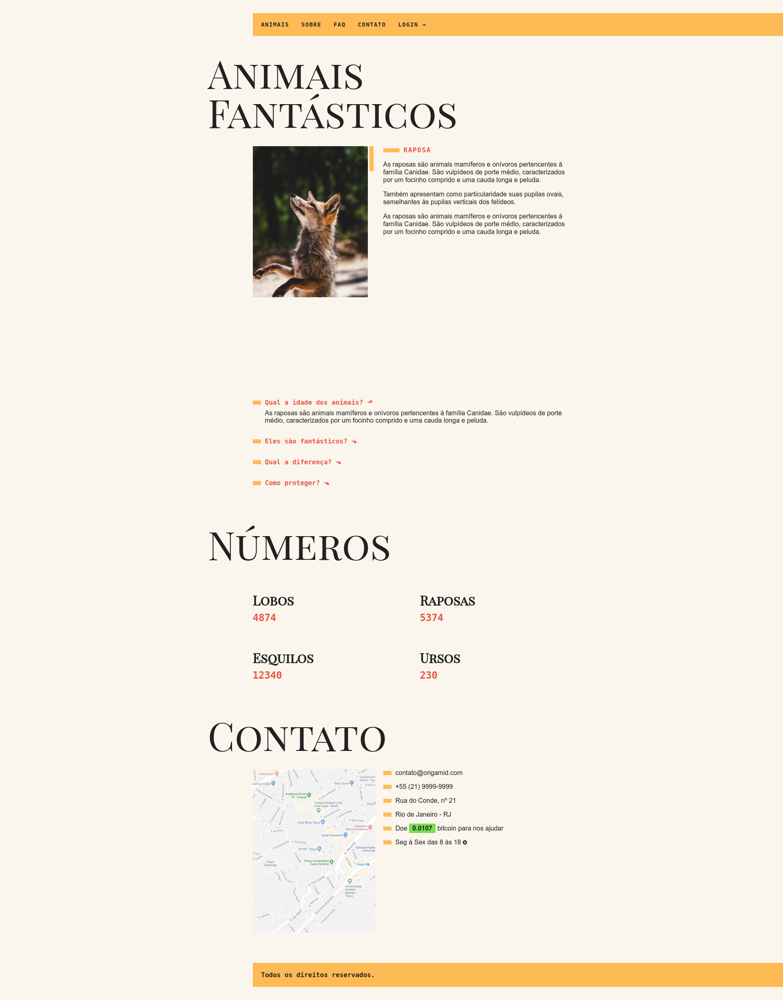

<h1 align="center">Projeto Animais Fantásticos</h1>

 

<h2 align="center">Print</h2>

  

## 🚀 Tecnologias

Esse projeto foi desenvolvido com as seguintes tecnologias:

- [HTML]
- [CSS]
- [JAVASCRIPT]
- [WEBPACK]

## 💻 Projeto

[Clique aqui](https://vyrs.github.io/animais-fantasticos/ "Site em Deploy") para conferir o site em seu browser 🖖

Projeto inspirado no animais fantásticos desenvolvido durante o Curso de JavaScript da Origamid com algumas melhorias que eu desenvolvi.
